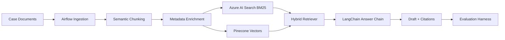

# Enterprise RAG Dispute Assistant

Production-style RAG assistant for dispute analysts. The system retrieves policy, case, and knowledge-base evidence, drafts grounded first responses, and records evaluation traces for continuous improvement.

## System Goals

- Reduce case-preparation time for analysts
- Keep first-draft responses within latency targets
- Enforce citation-first answer generation
- Make hallucination, retrieval quality, and token cost measurable

## Architecture

## Core Features

- Semantic chunking with overlap windows
- Metadata schema for source, section, effective date, jurisdiction, policy type, and document lineage
- Hybrid BM25/vector retrieval using Azure AI Search and Pinecone
- BERT re-ranking, freshness boosting, and section weighting
- Cite-first prompt templates with refusal defaults
- Evaluation hooks for faithfulness, citation coverage, latency, and hallucination risk

## Stack

Azure OpenAI · Azure AI Search · Pinecone · LangChain · FastAPI · Apache Airflow · Docker · AKS · OpenTelemetry · Grafana

## Evaluation Metrics

| Metric | Purpose |
|---|---|
| Recall@k | Checks whether relevant passages are retrieved |
| nDCG | Measures ranking quality |
| Citation Coverage | Tracks answer support from retrieved sources |
| Faithfulness | Measures groundedness and hallucination risk |
| Latency | Keeps analyst-facing drafting fast |
